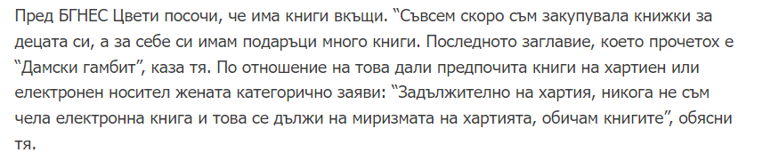
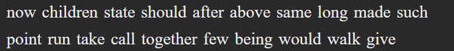
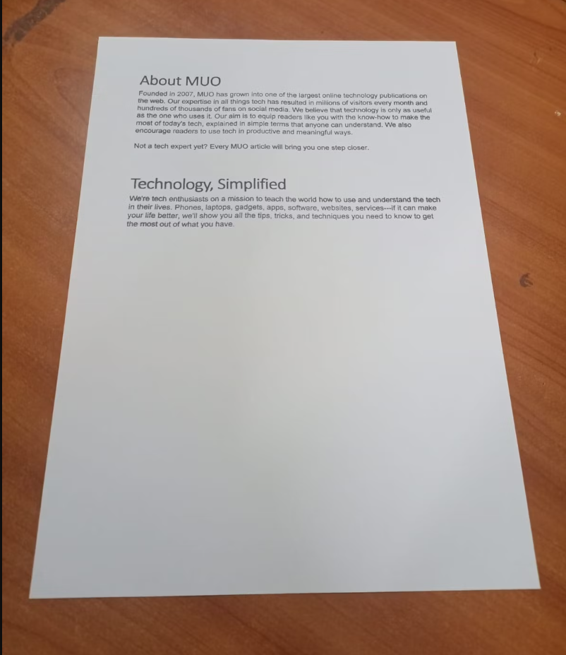
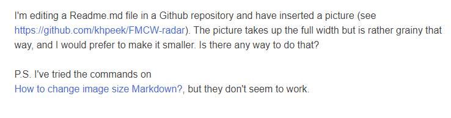

            TEXT FROM IMAGE TRANSLATOR

               SMALL THKINTER PROJECT
            
This program is using ot translate text from images.
User can use directly picture of text or picture of whole paper sheet.
If photo is taken from some angle, user can use TRANSFORM function to "straight" the image.

EXAMPLES:

Main window of the program. It have a buttons for UPLOAD, TRANSFORM, CHECK IMAGE,
INPUT fields for TARGET and SOURCE languages, also EXTRACT button, to extract the text from
For input languages program use abbreviations (iso 639-1 standard language codes).

When user select to transform image. In the middle of process a pop-up window appear.
User can see is contour detection is good. If points are matching corners of paper sheet
(red dots are temporary marking using OpenCV). In case that program cant detect the corners of
paper sheet. Error message will be raised.
We can continue with transforming the picture when second windows is closed. 
If program does not raise error message. Transforming process is finished.

When user use check button, can see the picture after transformation.
It turned in grayscale, because OCR module work better with gray images (EasyOCR in this case).
If transform function is not used in the case. User also can use the check button to see the image.

If language abbreviations have symbols that don`t corresponding to ISO 639-1 standard language codes.
Warning message will appear to screen. If user has forgot to upload image,
program will raise error again for missing image. 

When user click on extract button. After few seconds a second windows will appear.
Initially translated text is not shown. User can make corrections on extracted text and
after this to proceed with translation of text.

With translate function in the empty field will appear the translated text.
User can make corrections on translated text and after this can proceed with saving file.

User have option to save text  in three types of files.
.txt .doc . docx. 

Result in .docx file

